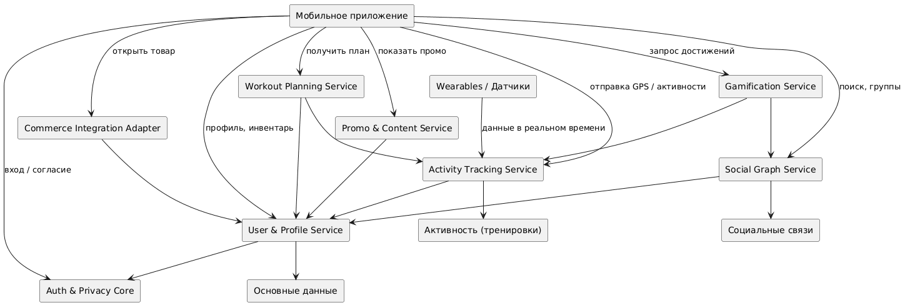
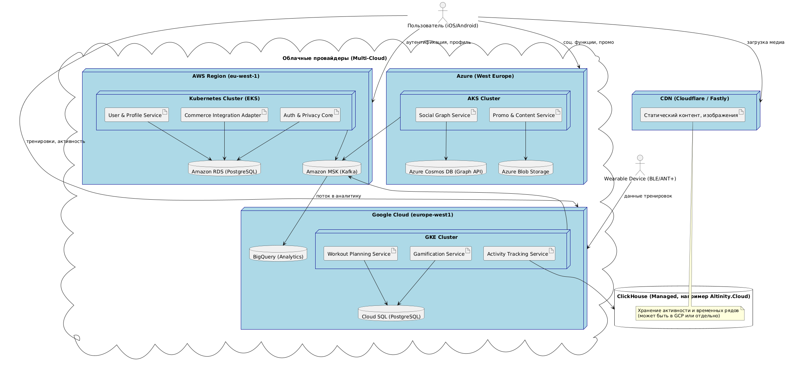

# Концептуальная архитектура

### Общая модель: Event-Driven Microservices с Bounded Contexts

#### Компоненты:

1. **User & Profile Service** — управление профилями, инвентарём, настройками приватности.
2. **Activity Tracking Service** — приём данных от мобильного клиента и устройств, обогащение метаданными (локация, маршрут и т.п.).
3. **Social Graph Service** — дружба, группы, рекомендации людей, поиск по интересам.
4. **Workout Planning Service** — генерация тренировок, учёт инвентаря, целей и истории.
5. **Gamification Service** — достижения, очки, рейтинги, вызовы.
6. **Promo & Content Service** — управление персонализированными промоакциями и новостями (с региональной настройкой).
7. **Commerce Integration Adapter** — интеграция с существующим e-commerce приложением.
8. **Analytics & Observability Layer** — сбор метрик, логов, трассировок, алертинг.
9. **Auth & Privacy Core** — единая система аутентификации и управления согласиями (Consent Management).

#### Инфраструктурные особенности:

* Multi-cloud: AWS для аналитики и ML, GCP для глобальной доставки контента, Azure для enterprise-интеграций.
* CI/CD с фича-флагами и canary-релизами.
* Хранение данных: гибрид — основные сервисы — в реляционных БД (PostgreSQL), графы — в Neo4j, активность — в ClickHouse.

#### Клиенты

* Мобильные приложения (iOS, Android).
* Возможность расширения до Wear OS / watchOS, веб-версии.